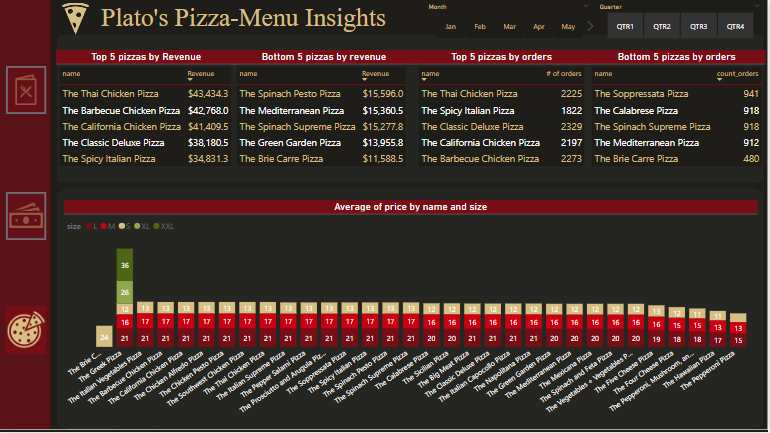

# PowerBI-Maves_pizza_challenge
Pizza sales dashboard

The Maven's Pizza challenge taken from the website was as follows:

  

The challenge asked to address the following questions in addition to any other insights:

  

The data provided had 4 tables:
- Order_details (FACT table)
  - PK: order_details_id FK: order_id, pizza_id
- orders (Lookup table)
  - PK:order_id
- pizzas (lookup table)
  - PK: pizza_id, FK: pizza_id, pizza_type_id
-pizza_type(lookup table)
  - PK: pizza_type_id 

A new Calendar table was created, primrarily since the project assignment required the inclusion of a calendar table and secondly because calednar tables are an essential component of a well-designed data model, providing consistency, flexibility, and performance benefits.

The date column in orders table was used to determine the time between which our data values lie. Since the data was for the year 2015, a calednar table was created using DAX as follows:

  

The final data model was then made in PowerBI and is provided as follows:

  

Before starting with the visualisations, some measures had to be created. 

Firstly to get insights into the revenue, new columns were created in the order_details table:

the order_details table initially contained the quatity column alone, an additional column with the price of each pizza taken from the pizzas table was made by using the following DAX function:

  

Another column was then added called the 'Sales' column which was a calculated column which used the *quanity * price* formula to determine the total sales per order.
Once this was done, revenue was easily calculated. 

Various new measures were made using dax and stored in a new measures table for better organisation. 

  

The time stamps provided in the orders table regarding each order complicated the data as it was difficult to get any insights from it. Power Query was used to convert the time to the nearest hour to be able to extract actionable insights from the data. The follows steps were performed:

  

The custom column created used the following formula:

  

The time column was first converted to a number format and the formula applied converted it to the nearest hour. The type was then changed back to the date. The other steps in the above query show the process of extracting the day names from the date column provided as they will be used in our analysis later on. 

Following this, a multi-page dashboard was created with buttons altering between each page using page navigation:

The first page from the dashboard is as follows:

  

This page uses filters for pizza category and pizza type and shows the main stats regarding the orders. A heat map is created using conditional formatting in a matrix with the time to the nearest hour as the columns and the day names as the rows. The heat map shows how the most number of orders seem to be around lunch and specifically at 1pm.
The dashboard also shows Friday as the day with the most number of orders. The variation in orders over year quarters and month are also show using a line graph. 

The second page of the dashbaord showed the key statistics regarding the revenue:

  

This dashboard also shows key statisitcs and changes in revenue over time. A stacked bar chart visual is use to show the revenue by category and size showing the vegetarian pizzas generate the most revenue. 
A scatter plot was also included to spot outliers when it comes to pizza. The x axis contained the quanitity of pizzas and the y axis had the revenue. This graph was very insightful and showed that:
- the big meat pizza in size small was the most ordered
- The greek pizza in size xxl was the lowest with low revenue and orders both, however the greek pizza in size large was a good seller overall. 

The third page of the dashboard delved into particulars of the menu and provided the best and worst pizzas by revenue and orders:

  

Filter with top/Botton N=5 were used for this purpose.

It showed that the Brie Carrie pizza seemed to be doing the worst when it comes to orders and revenue both.

A stacked bar chart was also included showing the average prices of the pizzas by name and size. This chart showed that the Brie carie pizza which was at the bottom for both revenue and orders was actually only sold in the size small and its price was higher than the other pizzas, a potential cause for the low performance. 

The full dashboard can be viewed [here](https://app.powerbi.com/links/otNeiqkPqM?ctid=402d2a37-422a-4cb6-9563-6afdf0cd3a39&pbi_source=linkShare):

